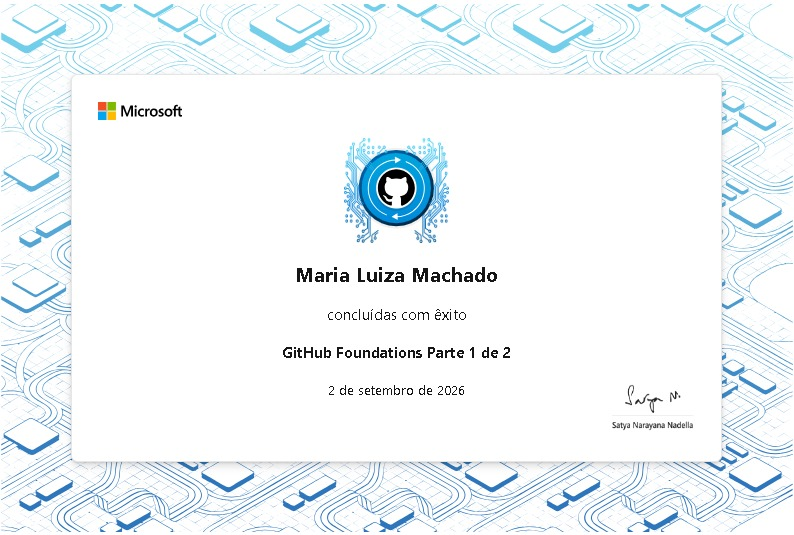

# Olá, eu sou a Maria Luiza 🪩

Estudante de Engenharia de Software.

Atualmente, estou desenvolvendo minhas habilidades na área de tecnologia, com foco em **automação**.

Meu principal objetivo é aperfeiçoar meus conhecimentos em automação, colocando o aprendizado em prática através de projetos.

Estou sempre buscando aprender, praticar e evoluir profissionalmente.

## Interesses 
* Automação 
* Desenvolvimento de Software 
* Tecnologia

## Tecnologias e Ferramentas
**Linguagens & Web**

**Ferramentas & Engenharia**

---

### 🎓 Certificações

* [Acessar conquistas no Microsoft Learn](https://learn.microsoft.com/pt-br/users/marialuizamachado-4717/achievements)
